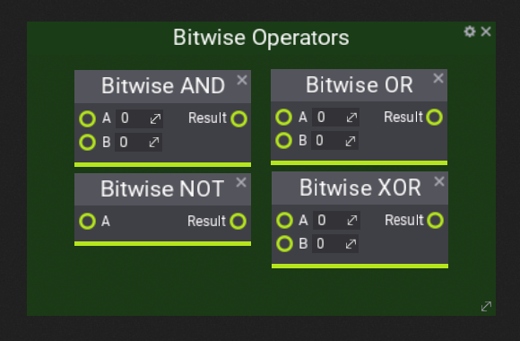

# Bitwise operator nodes

## Explanation
Bitwise operators apply the specific operator to each bit.

## Example

 A easy way of explaining it is like this, say we have 2 bytes and are using the AND operator.

We apply the AND operator to each bit.

|      Byte      |      ...     |
| :------------: | :----------: |
|  01001001      | 55 in binary |
|  01010101      | 49 in binary |
|  01000001      | Result: AND  |

Same goes for any other type of operator like XOR for example.

|      Byte      |      ...     |
| :------------: | :----------: |
|  01001001      | 55 in binary |
|  01010101      | 49 in binary |
|  00011100      | Result: XOR  |

## Nodes

You can learn more about the individual operators [here](boolean.md).
