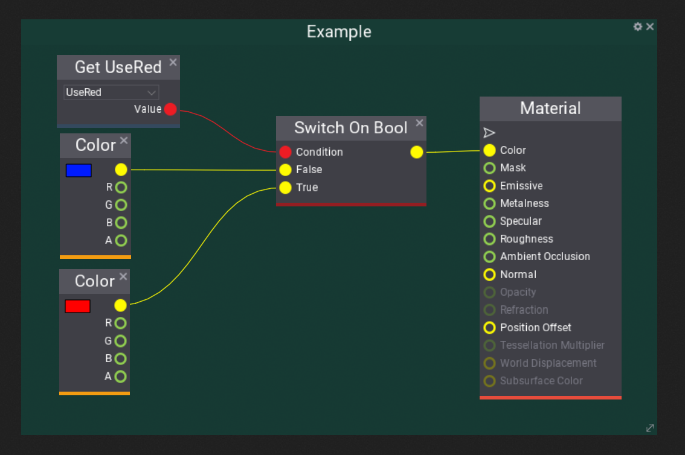
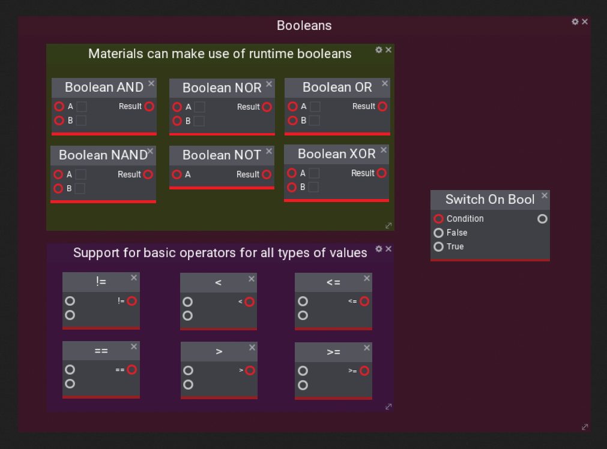

# Booleans

## Explanation
Flax supports using booleans in the material graph, this can be very helpful to apply conditional checks like using one texture or another for instance. All operators are supported as well as using switches to evaluate the state of a bool.

## Example

Below is a simple example for what booleans can be used for, like determining which [constant](constant.md) the material should use, this can of course extend to almost any type.

## Nodes

|      Node       |                                Description                              |
| :------------:  | :---------------------------------------------------------------------: |
|       AND       | True if A & B are true, else false.                                     |
|       OR        | True if either A and/or B are true.                                     |
|       NOR       | Inverse of OR, true if A and/or B are false                             |
|       NAND      | Inverse of AND, false if A & B are true, else true.                     |
|       NOT       | Inverts the state of A, so if true, then its false.                     |
|       XOR       | True if inputs are odd, so if either one of A & B is true, else false.  |

|      Node       |               Description                |
| :------------:  | :--------------------------------------: |
|       !=        | True if A and B are not equal.           |
|       <         | True if A is less than B.                |
|       <=        | True if A is less than or equal to B.    |
|       ==        | True if A and B are equal.               |
|       >         | True if A is greater than B.             |
|       >=        | True if A is greater than or equal to B. |
