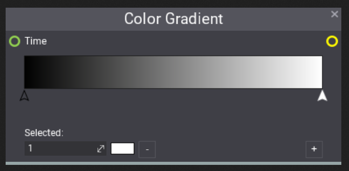

# Constants

## Explanation

Constants, unlike [properties](..\..\material-properties\index.md), are values that cannot change once set in the material or when playing the game and therefor won't be visible when creating a material instance.

Constants can be added, multiplied and appended to almost any other type, for instance a float can be added with a vector3, as a result the single float value would be applied to X,Y and Z.

You can also multiply a boolean with a vector3 or add an integer to a color for example.

### **Float constant**

Floats in short simply describe a floating point number.

However, think of a float more than just simple a number but also as a grayscale image, the closer to 0 the more darker the image would get and vice versa, the best way to visualize this is using a color gradient, here we can see the values 0 to 1 and all that is in between. 

This is the basis for things like heightmaps, that describe each pixel as a value between 0 and 1.

### **Signed & Unsigned Integer constant**

Integers are denary numbers, the difference between signed and unsigned are that unsigned integers cannot go below 0. This comes from the fact that unsigned integers use a sign bit to signify if the number is negative or not, unsigned integers fully use that bit but therefor cannot be negative.

|  Type    |                Min - Max              |
| :------: | :-----------------------------------: |
|  Int     | Min = -2147483648 & Max = 2147483648  |
|  UInt    | Min = 0 & Max = 4294967295            |

### **Bool constant**

A Bool constant is just a simple true (1) or false (0) value.

### **PI constant**

PI is a vital number in mathematics and commonly used in calculations involved finding the area of a circle or its circumference and many other formulas. Its value is equal to 3.142.

### **Vector(2,3,4) constant**

The constant vector outputs the specified amount of channels as a float value, think of it like having multiple floats in 1 single type. They can be used to describe both a position or a color where each channel can represent R,G,B or A respectively.

|    Vector      |           Description             |
| :------------: | :-------------------------------: |
|    Vector2     | Contains 2 channels: X & Y        |
|    Vector3     | Contains 3 channels: X, Y & Z     |
|    Vector4     | Contains 4 channels: X, Y, Z & W  |

### **Color constant**

A color constant is similar to a vector4 with the main difference being that its mainly purposed for colors as well as being able to use the color picker to determine its value.

|  Color |     Description     |
| :----: | :-----------------: |
|  R     |  The red channel    |
|  G     |  The green channel  |
|  B     |  The blue channel   |
|  A     |  The alpha channel  |

## Example

In this example we can multiply a constant float with Texcoords, this results in a tiling effect, the higher the number the more tiling occurs. Notice that Texcoords is a vector2 and our float constant multiplies it.

TODO: More examples

## Nodes

