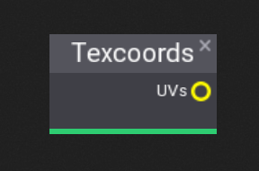
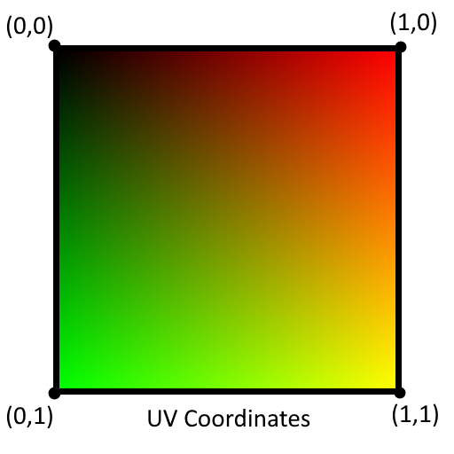

# Textures

## Explanation

One of the key aspects in materials are the ability to use texture information to modifiy the material itself. There are many types of textures such as regular textures, atlas textures, cube map textures,...

Each type of texture stores data in a different way.

## Textures types

### Cube Texture
TODO: Add Info

### Flipbook

Flipbook texture are mainly used for handling sprite textures which on store an array of images within a single image, the flipbook helps cycle through those images. This commonly used

### Normal Map
TODO: Add Info

### Parallax Occlusion Mapping
TODO: Add Info

### Sample Texture
TODO: Add Info

### Scene Color
Provides access to the current Camera's color buffer.

### Scene Depth
Scene depth allows you to access the Z-Buffer or depth buffer as its commonly called.

To learn more about depth buffers [click here](https://en.wikipedia.org/wiki/Z-buffering).

### Scene Texture
TODO: Add Info

### Texcoords

Game engines commonly use two texture coordinates, U and V, for mapping the width and height of a texture.

Texture coordinates range in a scale of 0.0 to 1.0.

> [!Note]
> Flax uses DirectX, OpenGL will have different UV Coordinates
 

### Texture

Allows you to read data from any type of image like a noise texture.